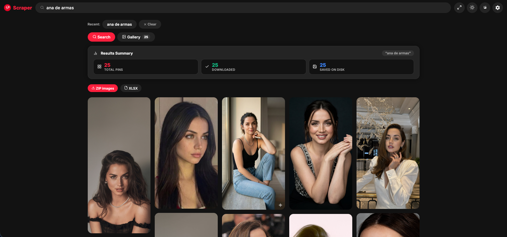
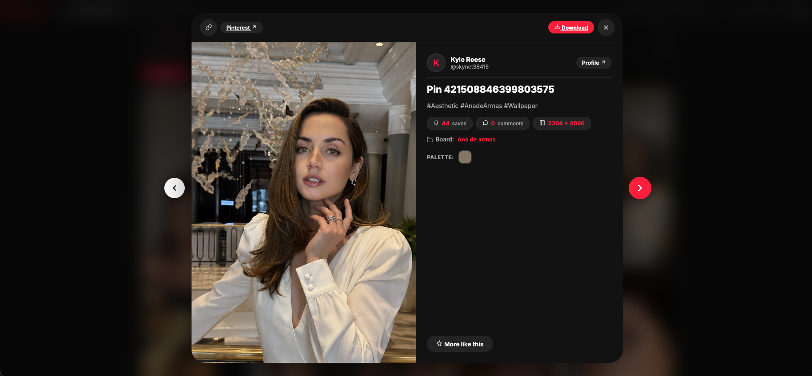
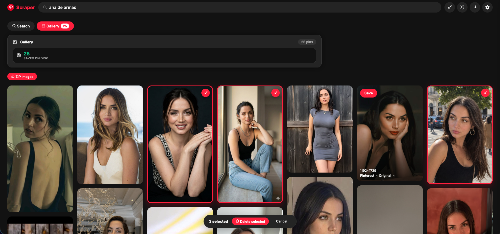
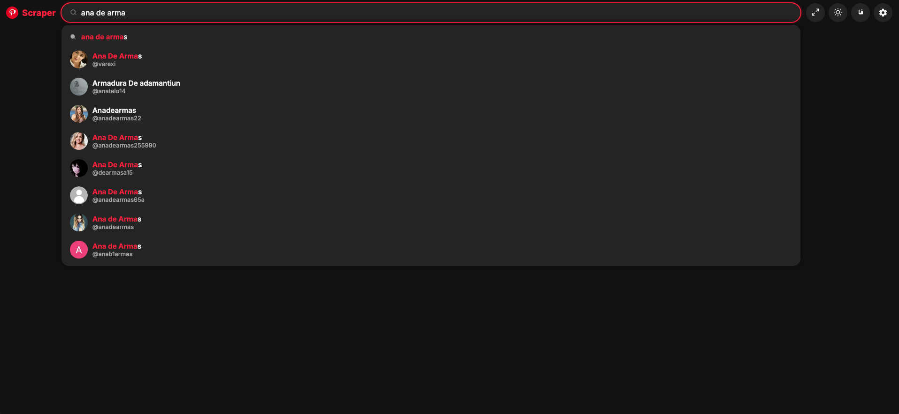
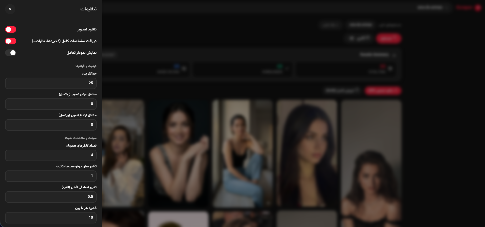
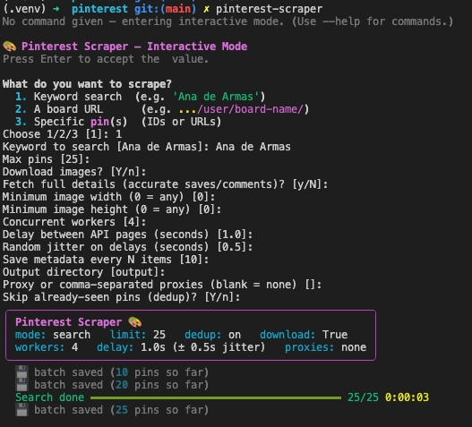
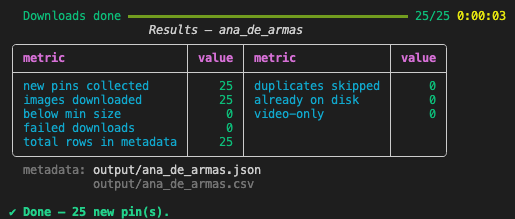

# 🎨 Pinterest Scraper

> Scrape Pinterest the easy way — original-quality pin images, rich structured
> metadata, and a beautiful experience in both the **browser** and the
> **terminal**. No login, no API key, no code required.

[](https://www.python.org/)
[](LICENSE)
[](https://github.com/EhsanShahbazii/Pinterest-Scraper/actions/workflows/ci.yml)
[](https://github.com/Textualize/rich)
[](https://fastapi.tiangolo.com/)
[](#-web-app-browser-ui)

## 📖 About

**Pinterest Scraper** talks to the same internal JSON resource endpoints the
Pinterest website itself uses — so you get **structured data, not scraped
HTML**. For every pin you collect, you receive the original-resolution image
URL plus everything Pinterest exposes about it: save / repin / like / comment
counts, creator and board info, external links, dominant colors, video URLs,
and every available image-size variant.

It ships with **two interfaces** sharing one engine:

| Interface | Best for |
|---|---|
| 🌐 **Web App** — Pinterest-styled browser UI with a masonry grid, settings drawer, live progress, and English/فارسی support | Everyone — point, click, scrape |
| 🖥 **CLI** — `rich`-powered terminal app with progress bars and a guided interactive wizard | Power users, automation, scripting |

Everything is polite and safe by design: requests are rate-limit aware,
fingerprint-randomized, images and metadata are **deduplicated across runs**,
and data is saved to disk in small crash-safe batches — so an interrupted run
never loses work.

## ✨ Features

- 🔍 **Three modes** — keyword `search`, whole `board`, or specific `pin`(s)
- 🖼 **Best quality** — images auto-upgraded to Pinterest `originals` CDN URLs
- 📊 **Full metadata** — saves, repins, likes, comments, creator, board, link,
  domain, dominant color, created date, video URLs, all image-size variants
- 🧹 **Persistent dedup** — never downloads or stores a pin twice (survives
  restarts; self-heals from your own metadata files)
- 💾 **Batched saving** — metadata written to disk every N items (crash-safe),
  merge-safe JSON + CSV output
- ⚡ **Concurrent** — parallel detail-fetching and multi-threaded downloads
- 🥸 **Random fingerprints** — per-request user-agent / Accept-Language /
  Referer rotation, random delay jitter, optional proxy pool rotation
- 🚦 **Rate-limit aware** — HTTP 429 randomized cooldown, exponential backoff
- 🖥 **Gorgeous CLI** — rich banner, live progress bars, results table, and a
  fully guided interactive wizard
- 🌐 **Web App** — masonry image grid, full settings panel, live SSE progress,
  bilingual English / فارسی (RTL), settings saved in your browser
- ♻️ **Resumable** — existing files are skipped, not re-downloaded

## 📸 Screenshots

### 🌐 Web App


**v1.3 power features:**
- ↔️ **Full-width edge-to-edge layout** — toggle between contained and wide Pinterest-style responsive grid
- 🖼 **Local Gallery DAM** — browse saved pins, long-press to multi-select, and bulk delete with real-time badge updates
- 🔍 **Live suggestions** with real user avatars & verified badges (debounced typeahead)
- 📌 **Pinterest-style detail modal** — high-res closeup, creator metadata, metric badges, dominant color palette, keyboard navigation
- 🌙 **Dark mode & modern SVG icons** — automatic system detection, clean vector iconography with zero emojis
- 💾 **Instant localStorage persistence** — settings drawer, dark/light theme, and wide layout persist seamlessly
- 🇮🇷/🇬🇧 **Bilingual English & Persian** — full RTL layout with Vazirmatn typography
- 🔮 **Visual search** — "More like this" finds visually similar pins directly from any pin
- ⬇️ **Direct exports** — one-click ZIP download of images and XLSX metadata spreadsheets
- 📊 **Engagement analytics** — interactive Chart.js bar chart for saves and engagement metrics

<!-- Row 1: Main search results -->
<p align="center">
  
</p>
<p align="center">
  <em>Results — Pinterest-styled search view with live stats summary and responsive masonry grid.</em>
</p>

<!-- Row 2: Closeup Modal & Gallery DAM -->
<p align="center">
  <table>
    <tr>
      <td align="center"></td>
      <td align="center"></td>
    </tr>
    <tr>
      <td align="center"><em>Closeup modal — high-res image, creator info, metrics & palette</em></td>
      <td align="center"><em>Gallery DAM — local images with hold-to-select bulk deletion</em></td>
    </tr>
  </table>
</p>

<!-- Row 3: Live typeahead & Persian settings drawer -->
<p align="center">
  <table>
    <tr>
      <td align="center"></td>
      <td align="center"></td>
    </tr>
    <tr>
      <td align="center"><em>Live suggestions — real-time typeahead with creator avatars</em></td>
      <td align="center"><em>Settings drawer — Persian RTL with Vazirmatn font & full controls</em></td>
    </tr>
  </table>
</p>

### 🖥 CLI

<p align="center">
  <table>
    <tr>
      <td align="center"></td>
      <td align="center"></td>
    </tr>
    <tr>
      <td align="center"><em>Interactive wizard</em></td>
      <td align="center"><em>Live progress bars & results summary</em></td>
    </tr>
  </table>
</p>

<details>
<summary>📁 Expected screenshot filenames</summary>

| File | Shows |
|---|---|
| `docs/screenshots/web-home.png` | Web app home / search screen |
| `docs/screenshots/web-results.png` | Masonry results grid |
| `docs/screenshots/web-settings.png` | Settings drawer |
| `docs/screenshots/web-farsi.png` | Persian (RTL) interface |
| `docs/screenshots/web-progress.png` | Live progress + stats |
| `docs/screenshots/cli-banner.png` | CLI banner / wizard |
| `docs/screenshots/cli-results.png` | CLI progress & results table |

</details>

## 📦 Install

```bash
git clone https://github.com/EhsanShahbazii/Pinterest-Scraper.git
cd Pinterest-Scraper
python3 -m venv .venv && source .venv/bin/activate
pip install .
```

Requires Python 3.10+. Dependencies (installed automatically):
`requests`, `rich`, `fastapi`, `uvicorn`.

## 🚀 Quick start

```bash
# Guided wizard (also the default when you run the command with no args)
pinterest-scraper

# Search a singer and download images ≥600px wide
pinterest-scraper search "Ana de Armas" -n 25 --download --min-width 600

# Rich per-pin stats, fetched concurrently
pinterest-scraper search "ariana grande" -n 50 --download --details --workers 6

# Scrape a whole board
pinterest-scraper board "https://www.pinterest.com/SanSwift12/your-voice-can-calm-the-ocean/" -n 100 --download

# Fetch specific pins
pinterest-scraper pin 69524387998262863 --download

# Full power: proxies + jitter + batch saving
pinterest-scraper search "dua lipa" -n 100 --download --details \
  --workers 6 --delay 1 --jitter 0.8 --batch-size 10 \
  --proxy "http://p1:8080,http://p2:8080"
```

Or as a Python library:

```python
from pinterest_scraper.http import build_session
from pinterest_scraper.scraper import search_pins

session = build_session()
pins = search_pins(session, "Ana de Armas", limit=10)
print(pins[0]["image_url"], pins[0]["saves"])
```

## 🧭 Commands & options

| Command | Description |
|---|---|
| `pinterest-scraper` | interactive wizard (default) |
| `pinterest-scraper search <query>` | keyword search |
| `pinterest-scraper board <url>` | scrape a board |
| `pinterest-scraper pin <id-or-url>...` | specific pins |
| `pinterest-scraper --help / -V` | help / version |

| Option | Default | Description |
|---|---|---|
| `-n, --limit` | 25 | max pins |
| `-o, --out` | `output/` | output directory |
| `--download` | off | download images |
| `--details` | off | per-pin detail fetch (accurate stats) |
| `--min-width/--min-height` | 0 | resolution filter |
| `--workers` | 4 | concurrent threads (downloads + details) |
| `--delay` | 1.0 | seconds between API pages |
| `--jitter` | 0.5 | random extra seconds on every sleep |
| `--proxy` | — | proxy or comma-separated pool (rotated per request) |
| `--timeout` | 20 | API request timeout (s) |
| `--batch-size` | 10 | save metadata every N items |
| `--no-dedup` | off | disable deduplication |

## 📁 Output layout

```
output/
├── images/<pin_id>.jpg      # highest-quality originals
├── <query>.json             # full metadata (all image variants included)
├── <query>.csv              # flattened, spreadsheet-ready
└── .seen_pins.json          # dedup store (delete to re-scrape)
```

## 🛡 Anti-detection & ethics

Every request gets a fresh fingerprint: 6 browser user-agents, 5
Accept-Language variants, randomized referers, jittered delays, optional
proxy rotation, and a dedicated 429 cooldown with exponential backoff.

Please be a good citizen: public data only, keep `--delay ≥ 1`, and remember
images belong to their creators — don't republish without permission.

## 🧱 Project structure

```
src/pinterest_scraper/
├── cli.py            # argparse subcommands + interactive wizard
├── config.py         # endpoints, fingerprint pools, CSV schema
├── http.py           # session, retries, proxy rotation, API helpers
├── scraper.py        # search / board / pin-details / normalization
├── downloader.py     # concurrent resumable image downloads
├── dedupe.py         # persistent self-healing dedup store
├── storage.py        # merge-safe batched JSON/CSV persistence
├── ui.py             # rich banner, progress bars, summary table
└── web/              # 🌐 browser app
    ├── server.py     # FastAPI: jobs, SSE progress, image serving
    └── static/       # SPA: HTML / CSS / JS (no build step)
docs/screenshots/     # 📸 your screenshots go here (see Screenshots)
```

## 🤝 Contributing

PRs welcome! `pip install -e .` for a dev install, then run
`pinterest-scraper --help` to verify.


## 🌐 Web App (browser UI)

No coding needed — run the built-in web app:

```bash
pinterest-scraper-web      # then open http://127.0.0.1:8000
# or: python -m pinterest_scraper.web
```

A Pinterest-styled single-page app:

- 🔍 **Search or Board mode** with a Pinterest-style masonry image grid
- ⚙️ **Settings drawer** — limit, min image size, workers, delay/jitter, batch save size, proxies, download/details/dedup toggles
- 🌍 **Bilingual**: English (default, Inter font) / فارسی (Vazirmatn, full RTL) — one-click toggle
- 💾 All settings persisted in your browser (localStorage)
- 📊 **Live progress** over Server-Sent Events: collecting → details → downloading, with stats summary
- 🖼 Click any card to open the original-quality image; results metadata saved under `web_output/`

API (for integrations): `POST /api/scrape`, `GET /api/jobs/{id}/events` (SSE), `GET /api/jobs/{id}/result`, `POST /api/jobs/{id}/cancel`

## 📄 License

MIT — see [LICENSE](LICENSE).
